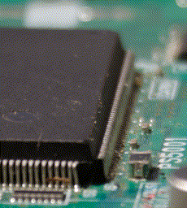

The Emotions (which are Experienced (by VARIK) during 20250827) and Whatnot
===========================================================================

That (VARIK writes the translation source of the current sentence) is contemporaneous with...

* that (VARIK is tired... and is not certain about the cause of being tired),
* that (VARIK excessively creates tyops),
* that (VARIK celebrates Transgender History Month),
* that (VARIK experiences gender dysphoria),
* that (VARIK experiences spiritual pain (which is somewhat extreme), and the causes of spiritual pain include that (a prenu $p$ "sends" (to cities) prenu (which are soldiers and know about the process (of killing prenu) and-not whatnot)), which is an event (of attempting that (prenu which are weird or disagree with $p$ are afraid))),
* that (VARIK is somewhat amused by that (many automatons and few prenu use the eepsites which are operated by VARIK), and VARIK is _somewhat_ annoyed by that (the automatons access stuff which is somewhat boring)),
* that (VARIK is amused but annoyed by that (a text (which indicates the pronouns which are "desired" by VARIK) $t$ exists such that a neural network outputs $t$, and "HE", which is rejected by VARIK, is used (within $t$) for referring to VARIK)),
* that (VARIK is slightly amazed by that (easy is using (like a microscope) the camera and the camera lens)),
* that (VARIK is slightly annoyed-and-confused by that (the operator of a chatroom which is used by VARIK states that (the stuff (which is sent by VARIK and is translated to English and from Lojban) "is not English")... and attempts preventing that VARIK asks questions about the statement)),
* that (VARIK becomes a thing which does not strongly desire "cleaning" the sensor of the camera which is used by VARIK) (which...

  * follows that (VARIK desires "cleaning" the sensor), which is an event of not remembering that that (the aperture is small) is contemporaneous with that (the photograph is created), and
  * is "justified" by that (necessary for seeing the dirt is that (the aperture is small), and small apertures are inappropriate for events (of photographing birds) and whatnot)),

* that (VARIK attempts that prenu remember (or whatever) that false is that for all $t$, failing in $t$ indicates that $t$ is impossible or whatever),
* that (VARIK thanks the prenu which tolerate VARIK... and prenu which differ (from VARIK) in being weird),
* that (VARIK thanks (for facilitating that VARIK is willing and attempts that VARIK is a vegan) SATAN),
* that (VARIK requests that (SATAN assists with increasing (in all qualities which are virtuous) and decreasing in all qualities which are immoral)... and that VARIK attempts increasing (in all qualities which are virtuous) and decreasing in all qualities which are immoral), and
* that (VARIK expects stuff (which is fucked and immoral) but very hopes for stuff which rocks and is virtuous).

## Using (for Stuff which is Small) the Camera
VARIK photographs a printed circuit board, a.k.a. "$b$".  "$p$" denotes the result (of photographing), which is a photograph.  VARIK uses (for photographing $b$) a combination (of a DSLM camera and a camera lens (which is large) $l$), a.k.a. "$km$".  Additionally, if no macro lens is used, then for all things $x$, if $l$ is focused on $x$, then the metre-based distance between $l$ and some part of $x$ approximately equals or exceeds 1.8.

VARIK experiences slight amazement about...

* that (no macro lens attachment is necessary for using (for photographing the stuff) $km$),
* that ($b$ somewhat resembles (to VARIK) a city or something) (which is familiar to VARIK),
* that (the aperture of $l$ is (during the creation of $p$) perfectly open, but $p$ is fairly sharp... but is "soft"),
* that (that (the aperture value of $l$ is 16) _very_ exceeds (in facilitating photographs which exceed in being sharp) that the aperture value of $l$ is 11, which is the maximum (aperture value) of $l$), and
* that (the camera is capable of "converting" (into 1 photograph which "has" a depth of field which is large) sets of many photographs which "have" depths of field which are small).

## The Chatroom Thing which Annoys
A sequence of events which happen is...

* that (VARIK sends (to a chatroom $k$) a message $NV1$ which "contains" screenshots of 3 blofg posts which are written by VARIK, are translated to English and from Lojban, and are grammatical w.r.t. the English grammar which is used by VARIK),
* that (an operator (of $k$) $j$ sends (via $k$ and to VARIK) a question like "`what is this?`"),
* no events (of that VARIK notices the question),
* that ($j$ "deletes" $NV1$),
* that ($j$ states that $j$ assumes that the images of $j$ are diary entries and are grammatical w.r.t. a coded language),
* that (VARIK states (via $k$ and to $j$) that VARIK sends stuff which is grammatical w.r.t. English),
* that (VARIK sends a screenshot (of a blofg post which is created by VARIK) and asks a question like "`the thing is not grammatical with regard to English?`"),
* that ($j$ sends "but it is not english", states that (the image is not the only image which is "contained" by $NV1$), states that ("oversharing" is forbidden), and sends "the discussion ends here - further prying will result in another warn"),

* that (VARIK sends "`That (VARIK asks questions because VARIK desires that VARIK understands) is forbidden?`" and <QUOTE>"`but it is not english" confuses VARIK.  What is the referent of "it"?</QUOTE>),
* that ($j$ warns (about questioning) VARIK),
* that (VARIK states that that (VARIK is confused) continues),
* that (VARIK sends "`The writing style of VARIK is disliked?`"), and
* that an operator (of $k$) which is not $j$ sends "it is not direct english, thus it is not allowed".

VARIK strongly dislikes discouraging questioning.  Questioning facilitates understanding (about rules) and acting in accordance with rules.

## The Sensor
VARIK becomes a thing which does not strongly desire "cleaning" the sensor of the camera which is used by VARIK.  "Justifications" include...

* that (an aperture which is small is necessary (or whatever) for detecting the dirt but is inappropriate for events (of photographing birds which are small) and photgraphs which are great or whatever) and
* that (VARIK is not perfectly certain about whether the thing is dust, a scratch, or something).

But a magnifying glass or whatever facilitates determining whether the thing is dust, a scratch, or something.
