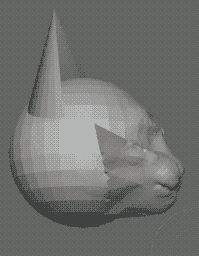

zo'e je le se cinmo be la .varik. bei de'i dy xi pa goi li re no re xa pi'e re pi'e pa so ge'u ja dy xi re goi li re no re xa pi'e re pi'e re no
================================================================================================================================================

ni'o klesi lo'i ro se ckaji be la .varik. .VALefor. bei de'i dy xi pa ja dy xi re fa ga ce...

* le ka ce'u mutce le ka ko'a goi ce'u xi re gleki le su'u ri nonlingeni je le su'u ko'a jimpe le du'u ri nonlingeni kei kei je le su'u le ka ce'u xi ci nonlingeni cu jinzi ko'a gi ga ce
* le ka ce'u gleki le su'u ri tonsi noi ku'i ke'a jinzi ga naje ce'u gi ri joi le xadni be ri gi ga ce
* le ka ce'u na ckaji ko'a goi le ka su'u lingeni kei tolpu'a ce'u xi re gi ga ce
* le ka ce'u gleki le su'u lo nu ce'u ko'a ckaji je lo nu tolpu'a ce'u fa lo nu co'e ja sruma lo jitfa ce'u cu jai .indika le du'u ce'u ri du gi ga ce
* le ka ce'u gleki zo'e je lo nu zo'e ja zo'oi .IT. pe lo glibau basyvla zo'e ja le cmene be ce'u gi ga ce
* le ka ce'u kanpe lo nu co'e ja catra le xadni be ce'u ki'u zo'e jo le su'u ce'u tonsi je cu cizra je cu mutce gi ga ce
* le ka ce'u na terpa lo nu morsi fa le xadni be ce'u gi ga ce
* le ka ce'u junri gi ga ce
* le ka ce'u zu'edji lo ka ce'u xi re badgau je sidju lo ro prenu kei poi ke'a ckaji le ka ce'u xi re toljursa je cu to'e vlile kei ni'i zo'e joi lo su'u ke'a mapti py ky goi le ka ro da poi ke'a xi re prenu zo'u ce'u xi re prami da gi ga ce
* le ka ce'u troci tu'a lo glare je vacri vartisyboi marce pixra... noi ke'a selcme la'oi .SUCHABEAUTIFULWAY. gi ga ce
* le ka ce'u troci lo nu ri zbasu lo calsamxra be le stedu be la .vynk. gi ga ce
* le ka ce'u gleki le su'u la'oi .Blender. jai filri'a tu'a lo tsautu pixra gi ga ce
* le ka ce'u na banzuka py ky lo ka ce'u xi re klaku gi ga ce
* le ka ce'u banzuka py ky lo ka ce'u xi re klaku je cu cizra vasxu gi ga ce
* le ka ce'u re'enje djica ga je...
	* py ky sy goi lo su'u lo ro fasnu je se lidne be le nu ce'u cusku dei cu nu ce'u prane py ky gi
	* lo su'o lo se me'oi .kibykaerni. be fi ce'u cu jai filri'a lo zabna je vrude noi mupli tu'a ke'a fa lo nu lo prenu ri fraxu je prami gi ga ce
* le ka le ro bangu be ce'u cu to'e banzuka fi lo ka ce'u xi re bangu fi lo velcki be le nu ce'u xi pa re'enje djica py ky sy gi ga ce
* le ka ce'u ci'au .oi re'e ga je...
	* zo'e gi ga je
	* lo ro nu jamna gi ga je
	* lo ro nu jdini bilma gi ga je
	* lo ro nu lo su'o prenu cu pinfu gi ga je
	* tu'a zo'e je zo'oi .CRIMINAL. poi ke'a sumvla fi lo glibau ku'o noi ke'a jai filri'a lo nu co'e ja tolmo'i lo du'u prenu gi ga je
	* tu'a zo'e je lo vlile metfo gi ga je
	* tu'a lo xarci gi ga je
	* lo ro vlile gi ga je
	* lo ro nu su'o da poi ke'a prenu zo'u su'o de poi ke'a prenu zo'u cfari fa lo su'o nu da de skuxai ja ckasu poi ke'a xrani de ja cu nu da na co'e ja troci lo nu xajmi de gi ga je
	* lo ro nu co'e ja xebni ja fengu lo su'o prenu kei noi ke'a nu xlafri jenai cu jimpe kei je cu jai filri'a ja rinka lo nu zenba lo ka ce'u xi re xlafri gi ga je
	* lo ro nu malku'i lo su'o prenu gi ga je
	* lo ro xrani be lo prenu gi ga je
	* lo ro nu lo su'o prenu banzuka lo ka co'e ja troci lo nu jitro ce'u xi re tu'a lo lijda kei kei lo ka ce'u xi re terpa tu'a lo nu ri sezbanzu lo su'u ri co'e ja re'enje jurpei kei kei ja lo nu lo prenu jenai du be ce'u xi re cu seljda lo na lijda be ce'u xi re kei ja cu co'e ja jinvi lo du'u lo ro prenu cu seljda naja cu co'e ja troci lo nu ri jitro lo prenu jenai du be ri tu'a lo lijda gi ga je
	* lo ro nu lo su'o prenu cu terpa tu'a lo nu ri co'e ja re'enje jurpei gi ga je
	* lo ro nu lo su'o prenu cu terpa tu'a lo nu ri sanji lo co'e ja te toltu'i be fi ri gi ga je
	* lo ro nu lo su'o prenu cu banzuka lo ka ce'u xi re terpa tu'a lo nu ri krici jenai djuno noi ke'a sarcu lo nu lijda ce'u xi re kei kei lo ka ce'u xi re co'e ja troci lo nu tolna'e tu'a lo co'e ja lijda be ce'u xi re kei kei noi ke'a jai rinka lo nu zenba lo ka ce'u xi re xlafri gi ga je
	* lo ro nu lo su'o prenu cu terpa tu'a lo nu ri krici jenai djuno gi ga je
	* lo ro nu lo su'o prenu cu co'e ja jinvi lo du'u sarcu fa lo nu ri seljda pe'a lo na te krici be fi ri gi ga je
	* lo ro nu su'o da poi ke'a prenu zo'u da co'e ja jinvi lo du'u mabla ja tolvu'e fa lo ro nu da seljda lo su'o co'e poi da na djuno lo du'u ke'a lijda lo su'o prenu jenai du be ce'u xi re gi ga je
	* lo ro nu lo su'o prenu tu'a lo lijda be ri terpa gi ga je
	* lo si'o pacraistu gi ga je
	* lo ro nu lijda pe'a ke xlafri bilma gi ga je
	* lo ro nu su'o da zo'u lo su'o prenu cu co'e ja xusra lo du'u ri tugni fi da kei jenai ku'i cu jimpe fi da gi ga je
	* lo ro nu su'o da poi ke'a prenu zo'u lo su'o prenu noi da mupli tu'a ke'a cu co'e ja dubji'isre zo'e ja lo velski be da da gi ga je
	* lo ro nu su'o da poi ke'a prenu zo'u lo su'o prenu noi da mupli tu'a ke'a cu banzuka lo ka ce'u xi re jundi lo bridi be fi re ce da be'o ja lo se zukte be da be'o noi mupli tu'a ke'a fa lo selnei ja xajmi be da kei lo ka ce'u xi re co'e ja tolmo'i lo du'u da prenu gi ga je
	* lo ro nu lo su'o prenu cu banzuka zo'e je lo ka ce'u xi re terpa lo nu ri to'e banzuka kei kei lo ka ce'u xi re co'e ja troci lo nu ri smimlu lo prenu jenai du be ri kei jenai cu tarti tu'a ce'u xi re kei noi ke'a jai rinka lo nu zenba lo ka ce'u xi re xlafri gi ga je
	* lo ro nu lo su'o prenu cu banzuka zo'e je lo ka ce'u xi re terpa lo nu ri to'e banzuka kei kei lo ka ce'u xi re co'e ja troci lo nu ri simlu lo ka ce'u xi ci banzuka kei kei joi lo nu lo prenu jenai du be ce'u xi re cu simlu lo ka ce'u xi ci to'e banzuka kei kei kei noi ke'a jai rinka lo nu zenba lo ka ce'u xi re xlafri gi ga ce
	* lo ro nu su'o da poi ke'a mabla ja tolvu'e je cu zilkai noi ke'a jinzi lo no prenu zo'u lo su'o prenu cu banzuka zo'e je lo ka ce'u xi re terpa lo nu ri ckaji da kei kei lo ka ce'u xi re co'e ja troci lo nu na facki lo du'u xu kau ri ckaji da kei kei kei noi ke'a jai filri'a ja rinka lo nu zenba lo ka ce'u xi re xlafri kei kei je cu to'e filri'a lo nu jdika da gi ga je
	* lo ro nu su'o da poi ke'a prenu zo'u su'o de poi ke'a jinzi da zo'u ga ja da terpa tu'a lo nu da tarti tu'a da ja cu stace fi da ja cu ckaji de gi lo su'o prenu noi da mupli tu'a ke'a cu co'e ja troci lo nu da na ckaji de gi ga je
	* lo ro nu lo su'o prenu cu terpa tu'a lo nu ri frica lo prenu jenai du be ri gi ga je
	* lo ro nu lo su'o prenu cu terpa tu'a lo nu ri smimlu lo prenu jenai du be ri gi ga je
	* lo ro nu su'o da poi ke'a prenu zo'u da co'e ja troci lo nu lo prenu noi da mupli tu'a ke'a cu na jimpe lo du'u da mo kau gi ga je
	* lo ro nu lo su'o prenu cu terpa tu'a lo nu ri jimpe fi ri gi ga je
	* lo ro nu lo su'o prenu cu na'e jimpe lo du'u ri mo kau gi ga je
	* lo ro nu lo su'o prenu tu'a ri na tarti noi ke'a nu xlafri gi ga je
	* lo ro nu su'o da poi ke'a prenu zo'u lo su'o prenu noi da co'e ja jinvi lo du'u ga ja...
		* da mabla ja palci ja cu ka'e mabla ja palci gi ga ja
		* da se jinzi lo su'o mabla ja tolvu'e gi ga ja
		* da co'e ja gunma loi se zukte be da gi ga ja
		* da narka'e lo ka re'enje ja cinmo se zbasu ce'u xi re gi ga ja
		* da narka'e lo zabna je vrude gi ga ja
		* da na .inda lo ka prami ce'u xi re gi ga ja
		* cumki fa lo su'o nu da zukte lo su'o te jerna be lo nu prami da gi ga ja
		* da narka'e lo ka ce'u xi re prane py ky gi ga ja
		* da se nandu lo nu da prane py ky gi
		* da na prenu noi ke'a jitfa gi ga je
	* lo ro nu lo su'o prenu cu co'e ja jinvi lo du'u ri se xebni ja cu se prami lo no prenu gi ga je
	* lo ro nu lo su'o prenu cu na'e jimpe lo du'u prami ri gi ga je
	* lo ro nu lo su'o prenu cu troci lo nu ri zukte lo su'o te jerna be lo nu prami ri kei kei kei noi ke'a nu na jimpe gi ga je
	* lo ro nu su'o da poi ke'a prenu zo'u da terpa lo nu da da prami ja lo nu da prami ja lo nu prami da gi ga je
	* lo ro nu lo su'o prenu cu baznuka lo ka ce'u xi re xenru kei lo ka ce'u xi re co'e ja tolmo'i lo du'u da kakne lo zabna je vrude... je cu prenu je cu zabna jenai cu co'e ja gunma loi se zukte be ce'u xi re gi ga je
	* lo ro nu su'o da zo'u lo su'o prenu cu djuno lo du'u ri da zukte je lo du'u da mabla ja tolvu'e kei je cu banzuka...
		* fe ko'a xi no goi lo ka ko'a goi ce'u xi re terpa lo nu sfasu ri tu'a da kei ja ga joi lo nu ko'a mabla ja palci ni'i zo'e joi lo su'u ko'a zukte lo mabla ja tolvu'e kei kei noi ke'a narcu'i gi lo nu ko'a jimpe lo du'u ri zukte da kei se ri'a lo nu ko'a co'e ja jinvi lo du'u ri mabla ja palci ge'u
		* fi ko'a xi no goi lo ka ko'a goi ce'u xi re co'e ja troci lo nu lo prenu noi ri mupli tu'a ke'a na jimpe lo du'u da se zukte ko'a je cu mabla ja tolvu'e kei kei ja cu terpa tu'a lo nu ko'a sisti lo pu'u ri zukte lo smimlu be da kei kei kei noi ke'a jai filri'a ja rinka lo nu zenba lo ka ce'u xi re xlafri kei kei je lo nu ranji fa lo pu'u zukte lo smimlu be da gi ga je
	* lo ro nu su'o da poi ke'a prenu zo'u su'o de zo'u lo su'o prenu noi da mupli tu'a ke'a cu djuno lo du'u de se zukte da je cu mabla ja tolvu'e kei je cu bnanzuka lo ka ce'u xi re terpa tu'a de lu'u ja tu'a da kei lo ka ce'u xi re co'e ja toldji ja terpa lo nu prami ja cnikansa da kei kei kei noi ke'a nu na jimpe gi ga je
	* lo ro nu su'o da poi ke'a prenu zo'u lo su'o prenu noi da mupli tu'a ke'a cu co'e ja toldji ja terpa lo nu prami ja cnikansa da kei kei noi ke'a nu na jimpe gi ga je
	* lo ro nu lo su'o prenu tu'a ri terpa gi ga je
	* lo ro nu su'o da poi ke'a prenu zo'u lo su'o prenu noi da mupli tu'a ke'a ku se nandu lo nu ri fraxu da gi ga je
	* lo ro nu lo su'o prenu cu na'e jimpe le du'u no da poi ke'a prenu zo'u su'o de zo'u da zukte de ca lo nu da jimpe lo du'u de tolvu'e gi ga je
	* lo nu co'e ja troci lo nu facki lo du'u xu kau lo mabla je tolvu'e cu zmadu lo mabla je tolvu'e le ka ce'u xi re mabla je tolvu'e gi ga je
	* lo ro nu su'o da poi ke'a prenu zo'u su'o de poi ke'a prenu zo'u lo su'o prenu noi da je de mupli tu'a ke'a cu co'e ja jinvi lo du'u da zmadu de zo'e ja lo ka ce'u xi re jerna lo nu xadni ri gi ga je
	* lo ro nu lo su'o prenu cu banzuka lo ka ce'u xi re jundi zo'e ja lo purci ja lo balvi kei lo ka ce'u xi re co'e ja tolmo'i lo du'u ri prenu gi ga je
	* lo ro nu lo su'o prenu cu banzuka lo ka ce'u xi re troci kei lo ka ce'u xi re co'e ja tolmo'i lo du'u ri zukte fi ma kau gi ga je
	* lo ro nu lo su'o prenu cu banzuka zo'e je lo ka ce'u xi re terpa kei lo ka ce'u xi re troci lo nu ri sutra jenai zo'e se ri'a lo nu ce'u xi re srera se ri'a lo mabla ja tolvu'e noi mupli tu'a ke'a fa lo mrori'a be lo xadni be lo prenu gi ga je
	* lo ro nu lo su'o prenu cu zukte lo su'o mabla ja tolvu'e lo su'u fanta lo mabla ja tolvu'e gi ga je
	* lo ro nu lo su'o prenu cu co'e ja djica lo su'o nu jamna kei kei noi ke'a nu jimpe fi lo no nu jamna gi ga je
	* lo ro nu lo su'o prenu cu co'e ja jinvi lo du'u sarcu fa lo su'o nu jivna ja lo su'o nu co'e ja xebni ja fengu lo su'o prenu gi ga je
	* lo ro nu lo su'o prenu cu co'e ja jinvi lo du'u sarcu fa lo su'o mabla ja tolvu'e gi ga je
	* lo ro nu lo su'o prenu cu banzuka lo ka ce'u xi re terpa tu'a lo prenu kei tu'a lo flalu gi ga je
	* lo ro nu lo su'o prenu cu co'e ja jinvi lo du'u lo flalu cu jai sarcu lo nu zifre gi ga je
	* lo ro nu lo su'o prenu cu selbaise'u gi ga je
	* lo ro nu me'oi .discard. lo na'e mabla noi mupli tu'a ke'a fa lo skami je selvau be lo dikca sigja gi ga je
	* lo ro nu lo su'o prenu cu banzuka zo'e je lo ka ce'u xi re co'e ja jinvi lo du'u ri na zifre kei kei lo ka ce'u xi re terpa tu'a lo nu lo prenu jenai du be ri cu zifre ja lo nu ce'u xi re zifre gi ga je
	* lo ro nu lo su'o prenu cu banzuka zo'e je lo ka ce'u xi re terpa lo nu ri claxu kei kei lo ka ce'u xi re terpa tu'a lo nu lo prenu jenai du be ri cu co'e ja ponse... kei ja cu lebna gi ga je
	* lo nu lo prenu cu terpa lo nu binxo ja lo nu binxo pe'a gi ga je
	* lo ro nu lo su'o prenu cu co'e ja jinvi lo du'u ri na zifre gi ga je
	* lo ro nu lo su'o prenu cu banzuka lo ka ce'u xi re xlafri kei lo ka ce'u xi re co'e ja tolmo'i lo du'u ri xlafri gi ga je
	* lo ro nu lo su'o prenu cu xlafri jenai cu jimpe lo du'u ri xlafri gi ga je
	* lo ro nu xlafri bilma gi ga je
	* lo ro nu lo su'o prenu cu banzuka lo ka ce'u xi re xlafri je cu ci'au .a'o nai kei ga ja...
		* lo ka ce'u xi re co'e ja djica lo nu ri na prenu ja lo nu na zasti ja lo daspo gi ga ja
		* lo ka ce'u xi re co'e ja troci lo nu ri na sanji lo mabla ja tolvu'e kei kei noi ke'a jai filri'a lo nu zenba lo ka ce'u xi re xlafri gi ga ja
		* lo ka ce'u xi re co'e ja troci lo nu xajmi fa lo mabla ja tolvu'e noi mupli tu'a ke'a fa lo snuti je mrori'a be lo xadni be lo prenu kei kei noi ke'a jai filri'a ja rinka lo nu zenba lo ka ce'u xi re xlafri kei kei je lo nu co'e ja tolmo'i lo du'u mabla ja tolvu'e kei kei je lo nu ranji fa lo pu'u zukte lo mabla ja tolvu'e gi ga ja
		* lo ka ce'u xi re co'e ja troci lo nu smimlu ri fa lo prenu jenai du be ri fi lo ka ce'u xi ci xlafri gi
		* lo ka ce'u xi re terpa tu'a lo nu sisti lo pu'u ri xlafri gi ga je
	* lo ro nu ci'au .a'o nai gi ga je
	* lo ro nu su'o da poi ke'a prenu zo'u da troci lo nu ri gleki kei se ri'a lo nu da zenba lo ka ce'u xi re xlafri gi ga je
	* lo ro nu lo su'o prenu cu co'e ja troci lo nu ri na co'e ja re'enje cinmo gi ga je
	* lo ro nu lo su'o prenu cu terpa tu'a lo nu ri banzuka lo ka ce'u xi re co'e ja re'enje jurpei kei lo ka ce'u xi re klaku gi ga je
	* lo ro nu lo su'o prenu cu terpa tu'a lo nu ri co'e ja re'enje cinmo gi ga je
	* lo ro nu lo su'o prenu cu banzuka tu'a lo bangu lu'u ja lo ka ce'u xi re besna pensi ja lo ka ce'u xi re mo'icli ja lo ka ce'u xi re troci lo nu ri djuno kei kei lo ka ce'u xi re na jimpe gi ga je
	* lo ro nu su'o da poi ke'a prenu zo'u su'o de poi ke'a cmima ga ce lo ka ce'u xi re nu da ckaji py ky gi ga ce lo ka ce'u xi re nu da sisti lo pu'u da zukte lo mabla ja tolvu'e gi lo ka ce'u xi re nu da prane py ky zo'u da banzuka lo ka ce'u xi re terpa lo nu lo ckaji be de na cfari ja lo nu da fliba tu'a de kei kei lo ka ce'u xi re na curmi lo ckaji be de gi ga je
	* lo ro nu lo su'o prenu cu banzuka lo ka ce'u xi re troci lo nu ri ckaji py ky kei kei lo ka ce'u xi re na ckaji py ky gi ga je
	* lo ro nu xlafri gi
	* lo ro nu ce'u na prane py ky kei noi ce'u fraxu ri ke'a gi ga ce
* le ka ce'u ci'au .ui re'e ga je...
	* zo'e gi ga je
	* le su'u cumki fa lo nu randa je lo nu cnikansa lo ro prenu zo'e je lo ka ce'u xi re xlafri kei kei je lo nu morji fi lo mabla ja tolvu'e je fasnu kei je lo nu prane py ky gi ga je
	* le su'u ce'u ri du gi ga je
	* le su'u ce'u ri na xadni gi ga je
	* le su'u lo velski be ce'u na velcki ce'u gi ga je
	* le su'u ce'u co'e ja re'enje cinmo gi ga je
	* le su'u ce'u zifre gi ga je
	* le su'u lo prenu cu frica ce'u gi ga je
	* le su'u ce'u dunli lo ro prenu zo'e je le ka ce'u xi re vajni gi ga je
	* le su'u prenu fa ce'u je lo ro prenu jenai du be ri gi ga je
	* le su'u prami ce'u fa la .satan. noi ke'a cevni ce'u gi ga je
	* le su'u la .satan. cu prami lo ro prenu jenai du be ce'u gi ga je
	* le su'u lo ro prenu je zukte be lo su'o mapti be lo si'o fraxu cu se fraxu la .satan. ju cu faxycpe ri gi ga je
	* le su'u prane py ky fa la .satan. gi ga je
	* tu'a le lijda be ce'u gi
	* le su'u py ky vrude lo su'o so'i so'i lijda gi ga ce
* le ka ce'u ci'au .a'o cai re'e ga je...
	* zo'e gi ga je
	* le su'u ce'u krici jenai djuno gi ga je
	* le su'u ce'u pacna lo na te djuno be fi ri gi ga je
	* le su'u sidju ce'u fa la .satan. gi ga je
	* le su'u filri'a fa lo nu jdaselsku ce'u gi ga je
	* le su'u .indika le du'u ce'u zenba py ky gi ga je
	* le su'u lo nu ce'u prane py ky ku narfaunarcu'i lo nu curmi ri fa ce'u gi ga je
	* lo ro nu ce'u banzuka py ky lo ka ce'u xi re na'e milxe lo ka ce'u xi ce klaku gi ga je
	* lo ro nu ce'u banzuka py ky lo ka ce'u xi re na'e milxe lo ka ce'u xi ce klaku kei kei kei ba'e je se lidne be lo nu ce'u ci'au .ii re'e le su'u cumki fa lo nu ce'u jdika lo vrude ja cu zenba lo tolvu'e gi ga je
	* le su'u ce'u krici ja jimpe le du'u py ky traji le ka ce'u xi re vajni je le ka ce'u xi re vrude gi ga je
	* le su'u ce'u na jitro ja birti fi lo balvi gi ga je
	* le su'u ce'u birti lo du'u ma kau se rinka lo nu prane py ky kei kei naje le du'u ro da poi ke'a prenu zo'u ro de poi ke'a nu da prane py ky zo'u ro di poi de co'e rinka ke'a zo'u di zabna je vrude ni'i zo'e joi lo su'u di mapti py ky gi ga je
	* le su'u ro da poi ke'a prenu zo'u na sarcu ko'a goi lo nu da prane py ky fa lo nu da troci ko'a ja cu platu fi ko'a ja cu terpa lo nu ko'a na cfari kei ja cu birti ja krici ja djuno lo du'u ko'a rinka ma kau gi ga je
	* le su'u ro da poi ke'a prenu zo'u ga je...
		* lo ro nu da co'e srera cu nu da na prane py ky gi ga je
		* lo ro nu da na prane py ky cu nu da ka'e zenba py ky gi
		* lo nu da facki lo du'u da zukte lo mabla ja tolvu'e cu jai .indika lo du'u da zenba gi ga je
	* le su'u ro da poi ke'a mabla ja tolvu'e je cu zilkai noi ke'a jinzi lo no prenu zo'u ro de poi ke'a prenu je cu ckaji de zo'u lo nu de jimpe je radji'i lo du'u de ckaji da cu filri'a lo nu de jdika da gi ga je
	* le su'u lo nu srera na fanmo lo pu'u kakne lo zabna je vrude gi ga je
	* le su'u cumki fa lo nu cilre fo lo nu srera gi ga je
	* le su'u lo si'o fraxu cu mapti lo mabla ja tolvu'e jenai zo'e gi ga je
	* le su'u gaurtcini lo ro prenu fa lo ro nu ri cikna co'e kei fi lo zabna je vrude gi ga je
	* le su'u no da zo'u xrani fa lo nu jimpe fi da gi ga je
	* le su'u na mabla ja tolvu'e ja xrani fa lo nu co'e ja re'enje jurpei gi ga je
	* le su'u ro da poi ke'a fasnu zo'u da nu binxo fa lo no fasnu je lidne be da gi ga je
	* le su'u no da poi ke'a prenu zo'u su'o de zo'u da zukte de ca lo nu da jimpe lo du'u de tolvu'e gi ga je
	* le su'u lo no prenu cu mabla ja palci ja cu ka'e mabla ja palci gi ga je
	* le su'u lo ro prenu cu prenu je cu zabna jenai cu co'e ja gunma loi se zukte be ri gi ga je
	* le su'u ro da poi ke'a cmima le ka ce'u xi re vajni ce le ka ce'u xi re jerna lo nu prami ri kei zi'o kei ce le ka ce'u xi re ka'e prane py ky zo'u ga je...
		* lo ro prenu cu prane da gi ga je
		* narcu'i fa lo ro nu lo su'o prenu cu jdika da gi
		* lo ro prenu noi ce'u mupli tu'a ke'a cu dunli fi da fe lo ro prenu noi mupli tu'a ke'a fa la .satan. gi ga je
	* le su'u narcu'i fa lo ro nu lo su'o prenu cu zukte lo su'o te jerna be lo nu prami ri gi ga je
	* le su'u banzuka fa lo ka ce'u xi re prenu gi ga je
	* le su'u ro da poi ke'a prenu zo'u ga je da se jinzi lo no mabla ja tolvu'e je cu ka'e prane py ky joi loi ro jinzi be da gi mapti py ky fa lo ro jinzi be da gi ga je
	* le su'u mapti py ky fa lo ro ka ce'u xi re tarti tu'a ri poi ke'a prenu gi ga je
	* le su'u ro da poi ke'a prenu jenai cu prane py ky zo'u lo nu da randa je cu jimpe je curmi lo nu da prane py ky kei noi ke'a na mutce lo ka ce'u xi re pluka da cu rinka lo nu da prane py ky gi ga je
	* le su'u ro da poi ke'a prenu zo'u lo nu da ckaji py ky cu rinka lo nu da randa gi ga je
	* le su'u tolmapti py ky fa lo ro jursa ja nu lo su'o prenu cu co'e ja troci lo nu ri jitro lo prenu jenai du be ri gi ga je
	* le su'u tolmapti py ky fa lo ro mabla ja tolvu'e gi ga je
	* le su'u sarcu fa lo no mabla ja tolvu'e gi ga je
	* le su'u na sarcu fa lo nu jivna gi ga je
	* le su'u na sarcu fa lo nu terpa gi ga je
	* le su'u na vrude fa lo ka ce'u xi re co'e ja sutra gi ga je
	* le su'u lo ro co'e cu vrude jo cu mapti py ky gi ga je
	* le su'u lo ro cadga cu mapti py ky gi ga je
	* le su'u su'o da zo'u vrude fa lo nu na zukte va'o da gi ga je
	* le su'u na mabla ja tolvu'e fa lo ka ce'u xi re co'e ja badri gi ga je
	* le su'u na mabla ja tolvu'e fa lo ka ce'u xi re co'e ja re'enje cinmo gi ga je
	* le su'u cumki fa lo nu sidju gi ga je
	* le su'u cumki fa lo toljursa je nu stace gi ga je
	* le su'u lo re'enje ja cinmo se zbasu cu jai filri'a lo nu cnikansa gi ga je
	* le su'u lo nu masno cu se filri'a lo nu vilco lo ka ce'u xi re jundi zo'e je lo ro prenu kei kei je cu to'e filri'a lo snuti je xrani be lo prenu gi ga je
	* le su'u lo su'o se xamsku cu mapti py ky gi ga je
	* le su'u na sarcu fa lo nu xamsku gi ga je
	* le su'u tu'a py ky krinu tu'a py ky gi ga je
	* le su'u tu'a py ky tadji tu'a py ky gi ga je
	* le su'u py ky ri jai jimpe velcki kei...
		* no'u le su'u ro da poi ke'a prenu jenai cu jimpe fi py ky zo'u lo nu da jimpe je zgana lo nu ckaji py ky cu filri'a ja rinka lo nu da jimpe fi py ky gi ga je
	* le su'u py ky jai to'e racli gi ga je
	* le su'u py ky re'enje rarna gi ga je
	* le su'u ro da poi ke'a prenu zo'u lo nu da certu na sarcu lo nu da prane py ky gi ga je
	* le su'u ro da poi ke'a prenu je cu xlafri zo'u lo nu da jimpe lo du'u prami da cu rinka lo nu da jdika lo ka ce'u xi re xlafri gi ga je
	* le su'u narcu'i fa lo ro nu lo su'o prenu cu jitro lo su'o prenu jenai du be ri lo su'u ri prami gi ga je
	* le su'u ro da poi ke'a prenu zo'u cumki fa lo nu prami da jenai cu tugni da jenai cu djuno lo du'u da mo kau gi ga je
	* le su'u lo ro prenu cu prane py ky janai le ka ce'u xi re jimpe fi py ky gi ga je
	* le su'u lo ro prenu cu prami ri janai cu ckaji py ky gi ga je
	* le su'u lo nu fraxu cu zmadu lo nu tolmo'i kei kei...
		* no'u le su'u ro da poi ke'a prenu zo'u ro de poi ke'a se zukte da je cu mapti lo si'o fraxu zo'u lo nu fraxu da tu'a de cu zmadu lo nu co'e ja tolmo'i lo du'u da zukte de kei kei kei ga je le ka ce'u xi re mapti py ky gi ga je lo ka ce'u xi re jai filri'a lo nu da jdika lo ka ce'u xi re xlafri gi lo ka ce'u xi re jai filri'a lo nu sisti lo pu'u zukte lo mabla ja tolvu'e gi ga je
	* le su'u ko'a goi le ka ce'u xi re prami cu banzuka zo'e je le ka ce'u xi re sampu je le ka ce'u xi re mutce kei le ka narcu'i fa lo nu ciksi ce'u xi re fo lo te gerna be lo bangu gi ga je
	* le su'u na sarcu fa lo nu ciksi ko'a fo lo te gerna gi ga je
	* le su'u lo nu skicu ko'a fo lo te genra cu cumki je cu jai filri'a lo nu facki lo du'u xu kau ko'a slabu lo prenu gi ga je
	* le su'u py ky velmikce lo ro mabla ja tolvu'e kei...
		* no'u le su'u ro da poi ke'a prenu zo'u ga je lo ro nu da prane py ky cu nu da ckaji lo no mabla ja tolvu'e gi ro de poi ke'a fasnu zo'u lo ro fasnu cu dubjavmau de lo ka ce'u xi re nu da ckaji py ky kei kei naja cu dubjavme'a de lo ka ce'u xi re nu da ckaji lo mabla ja tolvu'e gi ga je
	* le su'u py ky cimni kei...
		* no'u le su'u narcu'i fa lo ro nu lo su'o prenu cu banzuka py ky lo ka ce'u xi re tatpi lo su'u ri ckaji py ky kei ja cu jdika py ky gi ga je
	* le su'u narcu'i fa lo ro nu dukse py ky kei kei...
		* no'u le su'u narcu'i fa lo ro nu lo su'o prenu cu banzuka py ky lo su'o mabla ja tolvu'e gi ga je
	* le su'u py ky .inmune pe'a kei...
		* no'u le su'u ro da poi ke'a prenu zo'u ga je lo ro nu da co'e ja jdika py ky cu broda cei nu da zukte lo nu zmadu py ky zo'e ja lo ka ce'u xi re vajni da gi lo ro broda cu nu da na jimpe ge'u
		* no'u le su'u lo ro prenu cu du lo ro ka'e gasnu be lo nu ri jdika py ky ge'u
		* noi ke'a jai ctaipe le su'u na sarcu fa lo nu terpa gi
	* le su'u ro da poi ke'a prenu zo'u ro de poi ke'a nu da prane py ky zo'u ga je mapti py ky fa lo ro se zukte be da bei fau de gi de nu ga je li'armi je frili da fa lo ro vrude poi cadga fa lo nu da zukte ke'a fau de gi ga je da tcetce lo ka ce'u xi re jai toljursa lo ro prenu kei je cu cnikansa lo ro prenu zo'e je lo ka ce'u xi re xlafri kei je cu co'e ja xebni ja fengu ja se jai fanza lo no prenu je cu terpa lo no co'e je cu jai to'e xrani lo ro prenu je cu jai .indika le du'u na sarcu fa lo nu terpa gi li'armi fa lo du'u da jai to'e xrani lo ro prenu gi ga ce
* le ka ce'u kirsku la .satan. le ka ce'u xi re sidju ce'u xi pa je cu ciksi fi ri fe py ky fo le su'u ce'u xi re prane py ky kei kei je tu'a le su'u ce'u co'e ja re'enje cinmo je le su'u prenu fa ce'u je lo ro prenu jenai du be ri gi ga ce
* le ka ce'u cpedu fi la .satan. fe lo nu ri sidju ce'u py ky sy gi ga ce
* le ka ce'u jgari le bloxai je cu se jdaselsku lo cmalu je te gerna be la .lojban. gi ga ce
* le ka ce'u jgari le bloxai je cu se jdaselsku lo na te gerna gi ga ce
* le ka ce'u se jdaselsku lo na te gerna gi
* le ka ce'u kanpe lo mutce be le ka ce'u xi re mabla je tolvu'e kei je cu tcetcetce le ka ce'u xi re pacna ko'a goi lo tcetcetce be le ka ce'u xi ci zabna je le ka ce'u xi ci vrude ge'u kei je le ka ce'u xi re krici le du'u ko'a cumki

## le calsamxra be le stedu
ni'o la .varik. ku co'e ja troci lo nu ri zbasu ko'a goi lo calsamxra be le stedu be la .vynk.  .i la'e di'u rinka tu'a le pixra

.i la .varik. cu jinvi le du'u ko'a na prane le ka ce'u mabla... kei kei je ku'i ru'e le su'u cumki fa lo nu xagzengau pe'a

